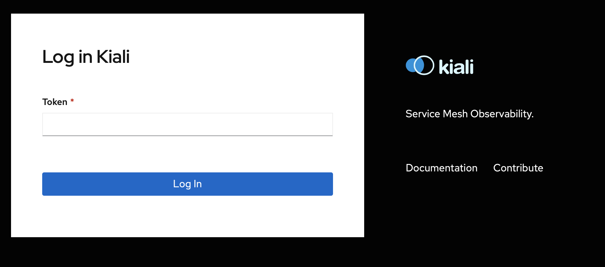
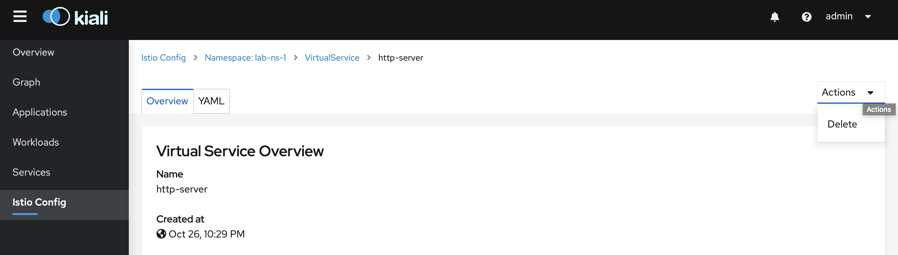
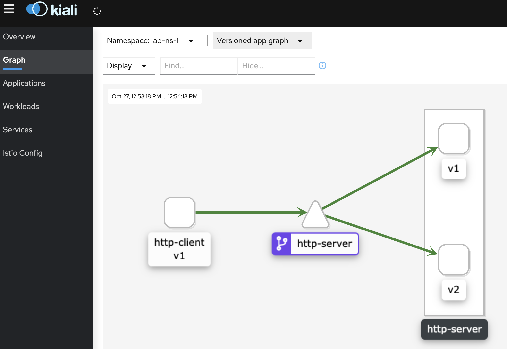

# Istio Lab Guide

## Lab overview


## Pre-Check

### Kubernetes dashboard

Dashboard is a web-based Kubernetes user interface. You can use Dashboard to get an overview of applications running on your cluster, as well as for creating or modifying individual Kubernetes resources (such as Deployments, Jobs, DaemonSets, etc). Dashboard also provides information on the state of Kubernetes resources in your cluster and on any errors that may have occurred.

**We'll use Dashboard to deploy containerized applications to a Kubernetes cluster and manage the cluster resources.**

#### Access the dashboard:
1. Open dashboard
2. Confirm access to an untrusted web-site (if needed)
3. Check k8s-dash authorization window and login via provided token
 
3. Write your lab namespace in the namespace search field:
    
4. Make sure that namespace navigation is correct: 

**Note: Some errors in Dasboard is OK during the Lab - this is related to fact that you don't have admin access to istio-system**

### Istio Kiali
Kiali is a management console for Istio-based service mesh. It provides dashboards, observability and lets you to operate your mesh with robust configuration and validation capabilities. 

**We'll use Kiali to see the structure of your service mesh by inferring traffic topology.** 

#### Access Istio Kiali:
1. Open Kiali
2. Confirm access to an untrusted web-site (if needed)  
3. Check Kiali authorization window and login via provided token
   
4. Make sure that Kiali is working: 

**Note: Some errors in Kiali is OK during the Lab - this is related to fact that you don't have admin access to istio-system**

### Istio Jaeger
Jaeger is a distributed tracing system released as open source by Uber Technologies. It is used for monitoring and troubleshooting microservices-based distributed systems.

**We'll use Jaeger to check distributed tracing in Istio.**

#### Access Istio Jaeger:
1. Open Jaeger
2. Confirm access to an untrusted web-site (if needed)
3. Check Jaeger  window


## Deployment
During this task we'll deploy our test applications into the cluster with Istio mesh. After this task, we'll gain the state as it was described in the Lab overview section.

Source code of test apps is available [here](https://github.com/mchudnovskiy/istiolabcode).

Steps:
1. Revise and import [lab-server-v1-deployment.yml](lab-tasks/../1-deploy/lab-server-v1-deployment.yml) via k8s dashboard:   
2. Revise and import [lab-client-deployment.yml](lab-tasks/../1-deploy/lab-client-deployment.yml) in the same manner 
3. Check namespace status:   
4. Check client logs
   * K8s dash: Pods (left bar) -> http-client-xxxxxx -> view container logs (up-right corner):
     
   
## Observability
During this task we'll check Istio observability features in the cases of service topology in Kiali and distributed tracing in Jaeger.  

Steps:
1. Check lab namespace in the Istio Kiali Service: 
   Kiali window -> Graph (from left bar)
    
2. Check lab namesapce in the Istio Jaeger Service:
    Jaeger window-> Select service "http-client.your-namespace-name" (from left bar) -> Press "Find traces" button (from left bar)
    

## Traffic management

### Fault Abort
During this task, we'll check the Istio fault injection feature in the case of HTTP abort fault.  After this task, we'll face 50% errors (503 HTTP) from the server's responses without any code changes.

Steps:
1. Revise and import [destination-rule](lab-tasks/../2-fault-abort/destination-rule.yml)
2. Revise and import [virtual-service](lab-tasks/../2-fault-abort/virtual-service.yml) 
3. Check lab namespace in the Istio Kiali Service: 
   * Kiali: Graph (left bar)  
   
4. Remove previously created virtual-service using kiali
   * Kiali: Istio Config (left bar) -> http-server (type: virtual service) -> Actions (up-right corner) -> Delete
     

### Fault Delay
During this task, we'll check the Istio fault injection feature in the case of HTTP delay fault.  After this task, we'll face 5s  delay from the server's responses without any code changes.

Steps:
1. Revise and import [virtual-service](lab-tasks/../3-fault-delay/virtual-service.yml)
2. Check lab namespace in the Istio Kiali Service 
   * Kiali: Workloads (left bar) -> http-client->Outbound Metrics 
   
3. Remove previously created virtual-service using kiali
   * Kiali: Istio Config (left bar) -> http-server (type: virtual service) -> Actions (up-right corner) -> Delete
     
4. Remove previously created destination-rule using kiali
   * Kiali: Istio Config (left bar) -> http-server (type: destination rule) -> Actions (up-right corner) -> Delete
     

### Canary release
During this task, we'll check the Istio traffic split feature in the case of canary release.  After this task, we'll face 2 versions of server app with traffict distribution 90:10.

Steps:
1. Revise and import additional server deloyment for a new version: [lab-server-v2-deployment.yml](lab-tasks/../4-canary-release/lab-server-v2-deployment.yml)  
2. Revise and import [destination-rule](lab-tasks/../4-canary-release/destination-rule.yml)   
3. Revise and import [virtual-service](lab-tasks/../4-canary-release/virtual-service.yml)
4. Check lab namespace in the Istio Kiali Service 
   * Kiali: Workloads (left bar) -> http-client->Outbound Metrics 
   
   

## Security 
During this task, we'll check the Istio security  feature in the case of mtls traffic upgrade.  After this task, we'll face encrypted traffic within the mesh without any code changes.

1. Check traffic mode for plain text
   * K8s dash: Pods (left bar) -> http-client-xxxxxx -> exec in container (up-right corner) -> istio-proxy
    * Run the shell command:
     ```shell
        curl http-server:8686/ping
    ```
    * Check result:
    
3. Change PeerAuthentication policy via Istio Kiali: Istio Config (left-bar) -> default (PeerAuthentication) -> change mode "DISABLE" to "STRICT"
   
4. Check traffic mode for strict mtls
    * K8s dash: Pods (left bar) -> http-client-xxxxxx -> exec in container (up-right corner) -> select istio-proxy container
    * Run the shell command:
     ```shell
        curl http-server:8686/ping
    ```
    * Check result:
    


